# 📄 Resumer – Online Resume Builder

> A sophisticated online resume creator designed to completely transform the way people compile their professional stories.

---

## 📖 About the Project

In today's highly competitive job market, an expertly written and well-designed resume is vital. **Resumer** is an interactive, user-focused platform that streamlines the customary resume-building procedure. 

The goal of Resumer is to provide users with a dynamic, user-friendly interface to create professional resumes quickly, reducing human error and minimizing the time it takes to apply for jobs. 

### ✨ Key Features
* **Template Selection:** Multiple eye-catching, flexible resume themes that cater to a wide range of industries.
* **Real-Time Interactive Dashboard:** Easily input pertinent information about your training, abilities, projects, and credentials.
* **Dynamic Form Validations:** Ensures data integrity and reduces formatting errors.
* **Resume Management:** Save and manage multiple versions of your resume in the "My-Document" section.
* **Export & Download:** Instantly download the professionally formatted resume in PDF format.

---

## 🏗️ System Architecture & Requirement Modeling

The project leverages a robust tech stack, combining modern frontend usability with scalable backend logic.

### The Tech Stack
* **Frontend:** HTML, CSS, JavaScript, TypeScript, and **AngularJS**.
  * *Why AngularJS?* It relies on an MVC (Model-View-Controller) architecture that excels in client-side rendering, Single-Page Application (SPA) capabilities, and rich dynamic content updates. 
  * **Backend:** **C#** and the **.NET Framework** on the server side to ensure stable API communication.
* **Database:** **MS-SQL Server** for secure, relational data management and storage.
* **Tools Used:** VS Code, Postman, SSMS, Figma.

### Data & Workflow Modeling
To ensure the application processes user data accurately, specific models were used:
* **Entity Relationship (ER) Diagram:** Maps out how users, resume templates, and profile sections (Education, Skills, Projects) relate to each other in the MS-SQL database.
* **Activity Diagram:** Tracks the step-by-step actions a user takes from landing on the homepage to successfully exporting a finished resume PDF.

---

## 📸 Application Workflow (Step-by-Step)

Our platform has been carefully designed to make the user experience as seamless as possible. Here is how the application flows:

### 1. Authentication & Onboarding
Users begin by registering an account to securely store their data.
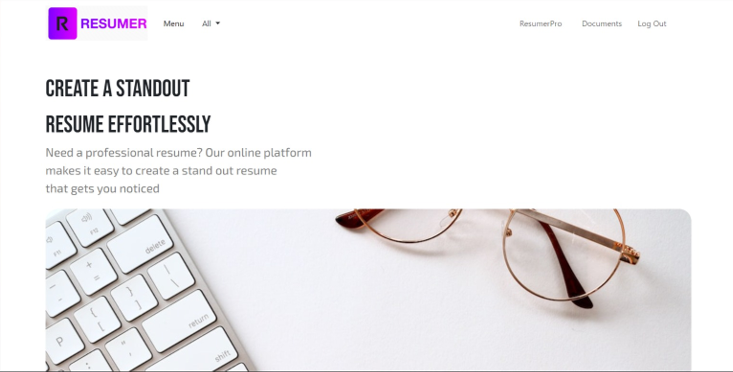
*Caption: Resumer Home Page*

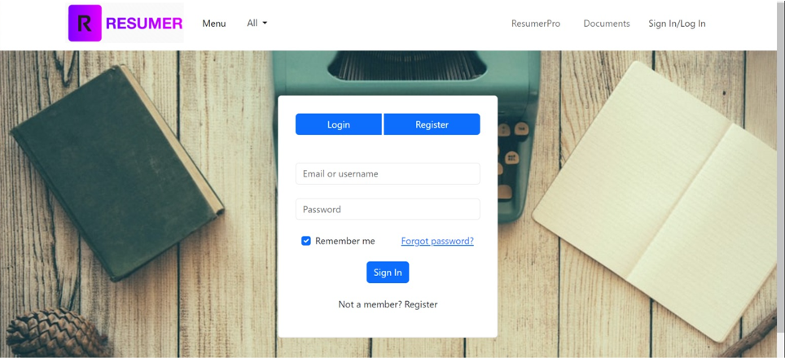
*Caption: User Registration Page*

### 2. Dashboard & Templates
Once logged in, users access their dashboard ("My-Document") and select an industry-appropriate template.
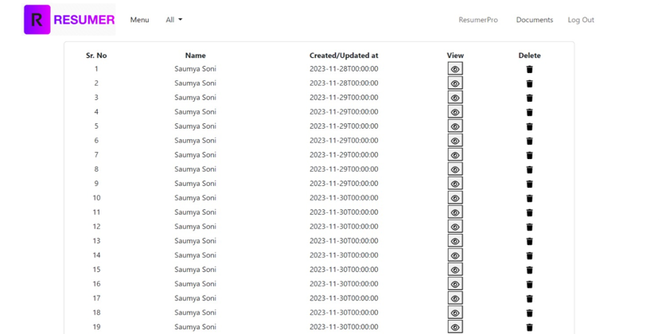
*Caption: Resume Management Dashboard*

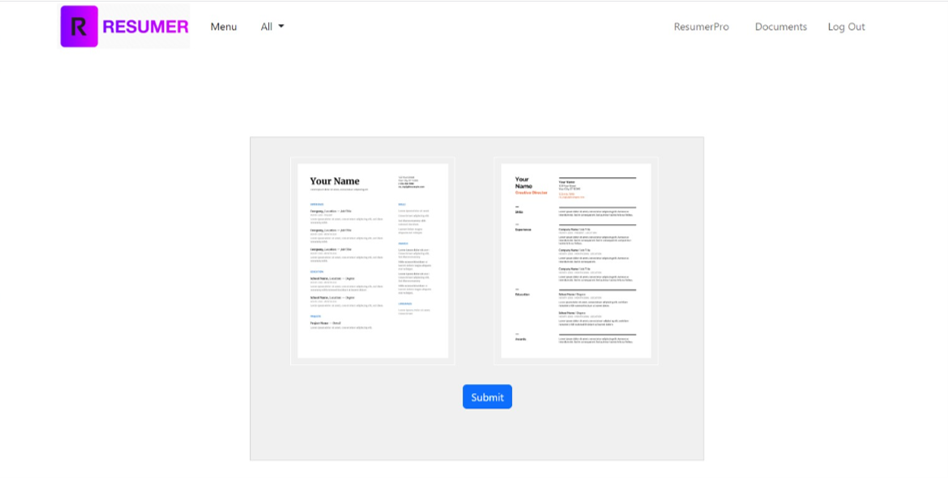
*Caption: Choosing an eye-catching template*

### 3. The Resume Creation Process
The application guides users through 6 intuitive steps to fill out their customized resume:

* **Step 1:** Personal Details
  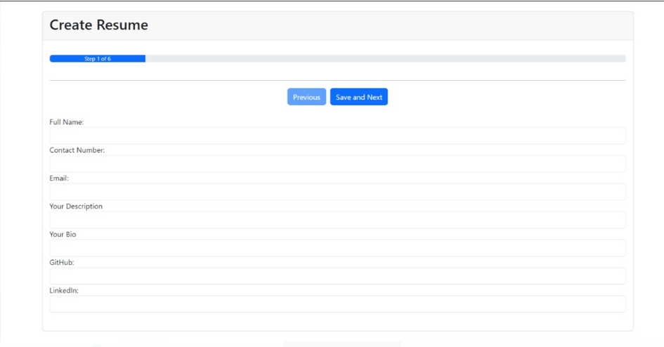
* **Step 2:** Educational Details
  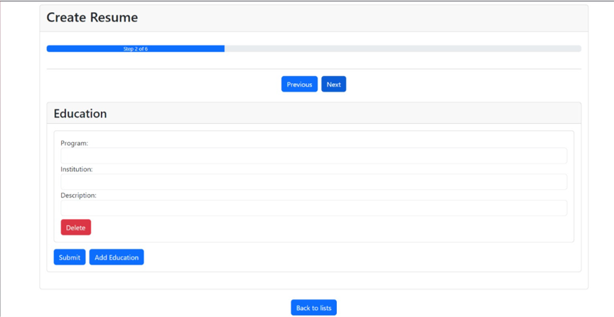
* **Step 3:** Work Experience
  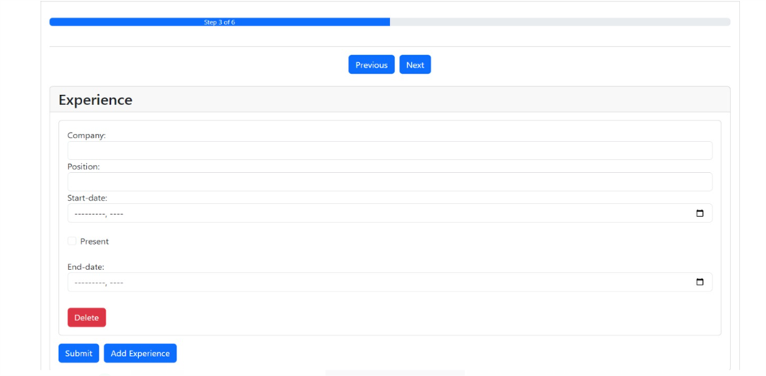
* **Step 4:** Project Details
  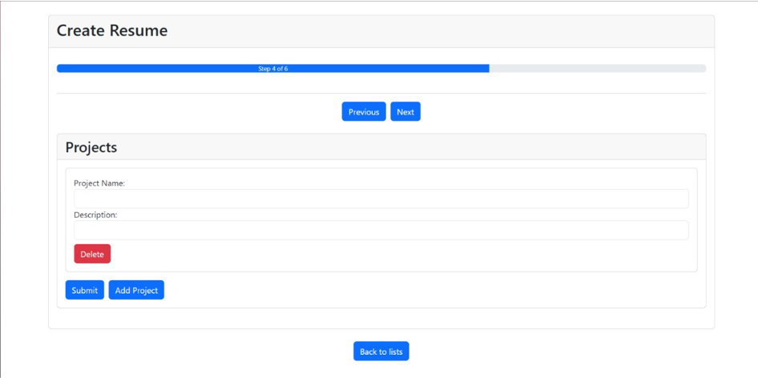
* **Step 5:** Skills Details
  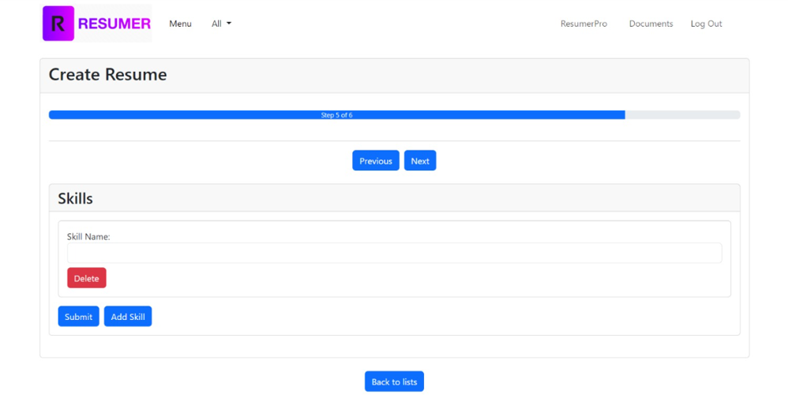
* **Step 6:** Certificate Details
  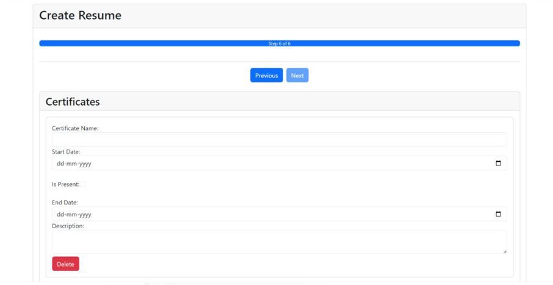

### 4. Review & Export
After entering all exact details, the program creates a customized resume. The user is shown a preview and given the option to download it.
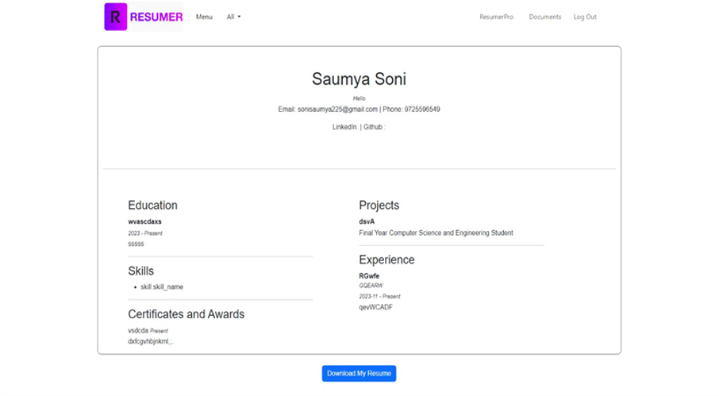


## 📁 Project Structure

The project follows a decoupled architecture with a RESTful .NET API and a component-based Angular frontend.

```text
resume-builder/
├── images/
│   ├── download_resume.png
│   ├── home_page.png
│   ├── resume_list.png
│   ├── step_1.png
│   ├── step_2.png
│   ├── step_3.png
│   ├── step_4.png
│   ├── step_5.png
│   ├── step_6.png
│   ├── template_selection.png
│   └── user_registration.png
│  
├── resume-api/                        # Backend: ASP.NET Core 7.0 Web API
│   ├── Controllers/                   # REST API Endpoints
│   │   ├── CertificateController.cs
│   │   ├── EducationController.cs
│   │   ├── ExperienceController.cs
│   │   ├── ProjectController.cs
│   │   ├── ResumeController.cs
│   │   ├── ResumeUserController.cs
│   │   ├── SkillController.cs
│   │   └── UserController.cs
│   ├── Models/                        # Entity Framework Core Data Models
│   │   ├── AppDbContext.cs            # Database Context (MS-SQL)
│   │   └── [Entities].cs              # User, Resume, Skill, etc.
│   ├── Program.cs                     # API Configuration & Middleware
│   └── appsettings.json               # DB Connection & Environment Settings
│
└── resume-app/                        # Frontend: Angular Framework
    ├── src/
    │   ├── app/                       # Core Application logic & Modules
    │   │   ├── app.module.ts          # Main Module initialization
    │   │   ├── app-routing.module.ts  # Application Route Definitions
    │   │   ├── app.service.ts         # Central Data & API Communication Service
    │   │   ├── informative/           # Landing Page & "About" UI
    │   │   ├── user-login/            # Authentication & Registration UI
    │   │   ├── resume-list/           # Dashboard (My-Documents view)
    │   │   ├── select-template/       # Resume Template Gallery
    │   │   ├── resume-create/         # Multi-step creation form (6 steps)
    │   │   └── resume-display/        # Resume Preview & PDF Export logic
    │   ├── assets/                    # Static Resources & Graphics
    │   │   ├── logo.png               # Project Branding
    │   │   └── [img1-6].jpg           # Template Thumbnails
    │   ├── index.html                 # Main Single Page Application Entry
    │   ├── main.ts                    # Angular Bootstrap File
    │   ├── styles.css                 # Global Application Styling
    │   ├── dom-to-image.d.ts          # Type Definitions for Image Export
    │   └── html2pdf.d.ts              # Type Definitions for PDF Generation
    ├── angular.json                   # Angular Build Configuration
    ├── package.json                   # NPM Dependencies & Scripts
    └── tsconfig.json                  # TypeScript Compiler Settings
```
---

## 👥 Team & Acknowledgments

**Created By:**
* Saumya Akshay Soni (20BCE285)
* Kavan Hemang Shukla (20BCE277)

**Guided By:**
* Prof. Daiwat A Vyas (Department of Computer Science and Engineering, Institute of Technology, Nirma University)

*Submitted in partial fulfillment of the requirements for the degree of Bachelor of Technology in Computer Science and Engineering, Nirma University, Ahmedabad.*
